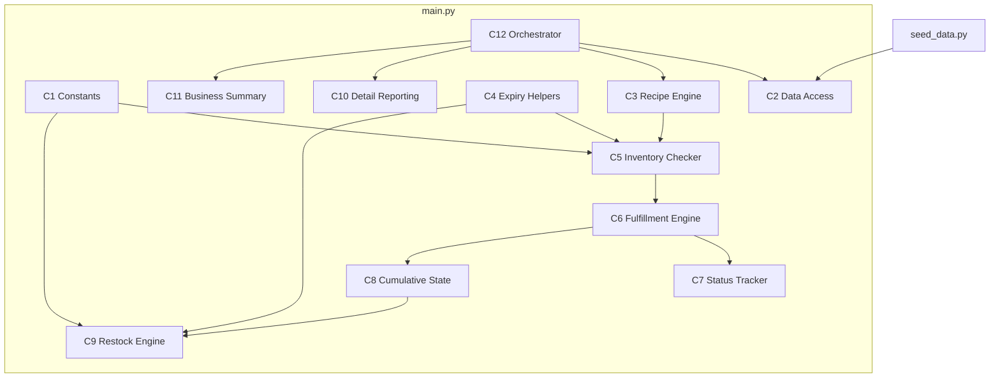
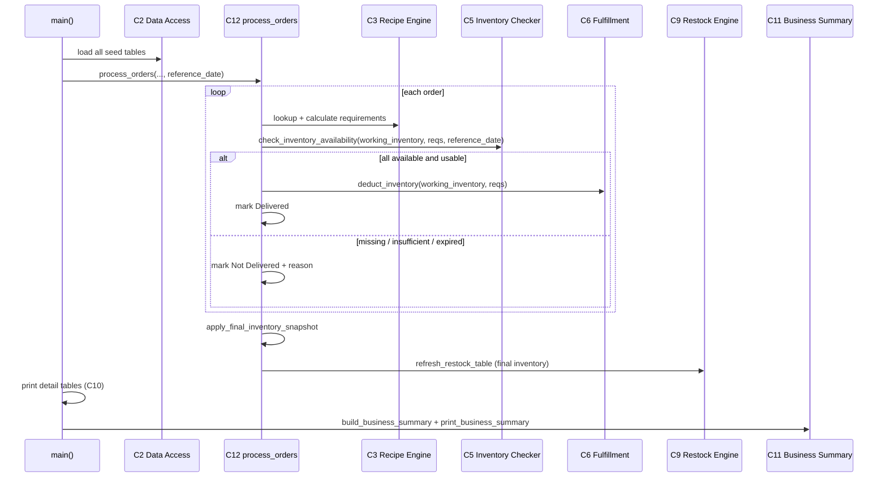

# Cloud Kitchen Inventory Simulation — Architecture Plan

This document describes how to complete Requirements 1–7 while keeping **all application logic in `main.py`** and **all tests in `test_main.py`**.

See `PROJECT_SPEC.md` for functional requirements, business rules, and verification status.

---

## 1. File organization

### Files we use

| File | Role | Change policy |
|---|---|---|
| `seed_data.py` | Seed tables only (recipes, inventory, orders, restock, status) | Do not add logic here |
| `main.py` | **All** application logic, orchestration, and console output | Primary implementation file |
| `test_main.py` | Unit tests for every public function in `main.py` | Add new test classes/methods here |
| `PROJECT_SPEC.md` | Requirements, status, design decisions | Update after each implementation phase |
| `ARCHITECTURE_PLAN.md` | This plan | Update if build order or components change |

### Files we do **not** create

- No extra Python modules (`inventory.py`, `restock.py`, etc.)
- No database, API, config, or web layers
- No duplicate seed files

### How `main.py` is organized (logical sections, one file)

Group functions with section comments in this top-to-bottom order:

```
main.py
├── Module constants (PAR_LEVEL_G, LOW_STOCK_THRESHOLD_G, EXPIRING_SOON_DAYS)
├── Section 1 — Data access (load_*)
├── Section 2 — Data display (print_* for raw tables)
├── Section 3 — Recipe engine (find_recipe_by_name, calculate_ingredient_requirements, combine_requirements)
├── Section 4 — Expiry helpers (parse_expiry_date, days_until_expiry, is_ingredient_usable)
├── Section 5 — Inventory engine (check_inventory_availability, deduct_inventory, apply_final_inventory_snapshot)
├── Section 6 — Status tracking (update_status_entry)
├── Section 7 — Restock engine (build_restock_reasons, calculate_restock_needs, refresh_restock_table)
├── Section 8 — Order orchestration (process_orders)
├── Section 9 — Processing display (print_order_processing_results)
├── Section 10 — Business summary (build_business_summary, print_business_summary)
└── Section 11 — Entry point (main)
```

New helpers for expiry, multi-reason restock, and the manager summary are added **inside `main.py`**, not in separate files.

### Test organization in `test_main.py`

Keep the existing test class structure and add new classes at the end:

| Test class | Covers |
|---|---|
| `TestLoadFunctions` | Req 1 — loaders (existing) |
| `TestOrderRecipeLookup` | Req 2 — recipe lookup and scaling (existing) |
| `TestOrderFulfillment` | Req 4 — deliver / not deliver (existing; extend for expiry) |
| `TestCumulativeInventoryDeduction` | Req 5 — sequential deduction (existing) |
| `TestRestockRules` | Req 6 — restock thresholds (existing; extend for multi-reason) |
| `TestInventoryExpiryCheck` | **NEW** — Req 3 expiry during fulfillment |
| `TestBusinessSummary` | **NEW** — Req 7 manager-facing summary |

All tests import from `main` only:

```python
from main import (
    check_inventory_availability,
    build_business_summary,
    print_business_summary,
    # ...
)
```

---

## 2. Components (logical units inside `main.py`)



### Component definitions

| ID | Name | Functions in `main.py` | Responsibility |
|---|---|---|---|
| **C1** | Constants | Module-level: `PAR_LEVEL_G`, `LOW_STOCK_THRESHOLD_G`, `EXPIRING_SOON_DAYS` | Single source for business thresholds (Req 6) |
| **C2** | Data Access | `load_recipes`, `load_inventory`, `load_orders`, `load_restock`, `load_status` | Return seed tables unchanged (Req 1) |
| **C3** | Recipe Engine | `find_recipe_by_name`, `calculate_ingredient_requirements`, `combine_requirements` | Map order items → ingredient demand (Req 2) |
| **C4** | Expiry Helpers | `parse_expiry_date`, `days_until_expiry`, `is_ingredient_usable` | Shared date math for C5 and C9 (Req 3, 6) |
| **C5** | Inventory Checker | `check_inventory_availability` | Verify presence, quantity, and usability (not expired) (Req 3) |
| **C6** | Fulfillment Engine | `deduct_inventory` | Subtract grams only after full-order pass (Req 4) |
| **C7** | Status Tracker | `update_status_entry` | Write `delivered` and `remark` per order (Req 4) |
| **C8** | Cumulative State | `apply_final_inventory_snapshot`; `working_inventory` inside `process_orders` | Order N sees stock after orders 1…N−1 (Req 5) |
| **C9** | Restock Engine | `build_restock_reasons`, `calculate_restock_needs`, `refresh_restock_table` | Multi-reason restock from final inventory (Req 6) |
| **C10** | Detail Reporting | `print_recipes`, `print_inventory`, `print_orders`, `print_restock`, `print_status`, `print_order_processing_results` | Technical console tables (Req 1) |
| **C11** | Business Summary | `build_business_summary`, `print_business_summary` | Manager-facing end-of-run report (Req 7) |
| **C12** | Orchestrator | `process_orders`, `main` | Wire pipeline; no inventory reset between orders | 

### Data shapes to extend (stay in `main.py` return values)

**Inventory check detail** — extend existing dict:

```python
{
    "ingredient": str,
    "required_qty_grams": int,
    "available_qty_grams": int,
    "is_available": bool,
    "unavailability_reason": str | None,  # "missing" | "insufficient" | "expired"
    "expiry_date": str | None,
    "days_until_expiry": int | None,
}
```

**Restock row** — extend for Req 6:

```python
{
    "item": str,
    "current_qty_grams": int,
    "reasons": list[str],        # all applicable reasons
    "qty_needed_grams": int,
    "expiry_date": str,
    "days_until_expiry": int,
}
```

**Business summary** — new structured object for C11:

```python
{
    "orders_delivered": int,
    "orders_not_delivered": int,
    "failed_orders": list[{"order_id", "reason"}],
    "final_inventory": list,     # snapshot for display
    "restock_recommendations": list,
    "inventory_alerts": list[{"ingredient", "issue"}],  # low / out / expired / expiring soon
}
```

### New functions to add (all in `main.py`)

| Function | Component | Purpose |
|---|---|---|
| `parse_expiry_date(expiry_str)` | C4 | Parse `YYYY-MM-DD` from inventory |
| `days_until_expiry(expiry_date, reference_date)` | C4 | Days until expiry (negative = expired) |
| `is_ingredient_usable(inventory_item, reference_date)` | C4 | Returns `(bool, reason_or_none)` |
| `build_restock_reasons(item, reference_date)` | C9 | Returns `list[str]` of all applicable reasons |
| `build_business_summary(processed_orders, inventory, restock, status)` | C11 | Build summary dict |
| `print_business_summary(summary)` | C11 | Plain-language console output |

### Functions to modify (not replace)

| Function | Change |
|---|---|
| `check_inventory_availability` | Accept `reference_date`; treat expired stock as unavailable |
| `process_orders` | Pass `reference_date` into inventory check; improve failure remarks for expiry |
| `calculate_restock_needs` | Use `build_restock_reasons`; output multi-reason rows with expiry fields |
| `print_restock` | Display `reasons` list and expiry columns |
| `main` | Call `print_business_summary` after processing |

---

## 3. Build order

Build in dependency order. After **each phase**, run the full test suite:

```bash
python -m unittest test_main.py -v
```

| Phase | Component | Requirement | Work in `main.py` | New tests in `test_main.py` |
|---|---|---|---|---|
| **0** | Baseline | — | No behavior change; add section comments and constants block | Confirm all 20 existing tests pass |
| **1** | C1 Constants | Req 6 | Extract `1000`, `10000`, `5` to module constants; use in restock | None (refactor only) |
| **2** | C4 Expiry Helpers | Req 3, 6 | Add `parse_expiry_date`, `days_until_expiry`, `is_ingredient_usable` | `TestInventoryExpiryCheck` — helper unit tests |
| **3** | C5 Inventory Checker | **Req 3** | Extend `check_inventory_availability(inventory, requirements, reference_date)` | Expired ingredient → `is_available=False`, reason `expired` |
| **4** | C6 + C7 Fulfillment | **Req 4** | Update `process_orders` to pass `reference_date`; expiry in status remarks | Expired stock blocks delivery; remark mentions expiry |
| **5** | C8 Cumulative State | Req 5 | Regression check only — no logic change expected | Re-run existing `TestCumulativeInventoryDeduction` |
| **6** | C9 Restock Engine | **Req 6** | Add `build_restock_reasons`; replace `elif` chain; enrich restock row shape | Multi-reason row; expiry fields present |
| **7** | C10 Detail Reporting | Req 1, 6 | Update `print_restock` for new row shape | Optional smoke test on print output structure |
| **8** | C11 Business Summary | **Req 7** | Add `build_business_summary`, `print_business_summary`; call from `main` | `TestBusinessSummary` — counts, failures, alerts |
| **9** | Integration | All | Full manual run: `python main.py`; update `PROJECT_SPEC.md` statuses | Full suite green |

### Why this order

1. **Constants (Phase 1)** — restock and expiry share the same thresholds.
2. **Expiry helpers before inventory check (Phases 2–3)** — one implementation reused by restock.
3. **Fulfillment updates (Phase 4)** — depends on new inventory check shape.
4. **Cumulative verification (Phase 5)** — ensure expiry changes did not break deduction order.
5. **Restock rewrite (Phase 6)** — uses final inventory and same expiry helpers.
6. **Summary last (Phase 8)** — aggregates outputs from fulfillment, inventory, and restock.

### Planned test additions (summary)

| Test class | Example test methods |
|---|---|
| `TestInventoryExpiryCheck` | `test_expired_ingredient_is_not_usable`; `test_sufficient_quantity_but_expired_fails_check`; `test_days_until_expiry_negative_means_expired` |
| `TestOrderFulfillment` (extend) | `test_process_orders_marks_not_delivered_when_ingredient_expired` |
| `TestRestockRules` (extend) | `test_low_and_expiring_soon_preserves_both_reasons`; `test_restock_row_includes_expiry_fields` |
| `TestBusinessSummary` | `test_summary_counts_delivered_and_not_delivered`; `test_summary_lists_failed_orders_with_reasons`; `test_summary_includes_restock_and_inventory_alerts` |

---

## 4. Pipeline flow (single run)



---

## 5. Completion checklist

- [ ] Phase 0 — Section comments + constants; 20 tests pass
- [ ] Phase 1 — Magic numbers replaced with C1 constants
- [ ] Phase 2–3 — Expiry helpers + inventory check (Req 3)
- [ ] Phase 4 — Fulfillment remarks include expiry (Req 4)
- [ ] Phase 5 — Cumulative deduction regression (Req 5)
- [ ] Phase 6 — Multi-reason restock with expiry fields (Req 6)
- [ ] Phase 7 — `print_restock` shows new shape
- [ ] Phase 8 — Business summary in `main()` (Req 7)
- [ ] Phase 9 — `PROJECT_SPEC.md` verification statuses updated to Complete
